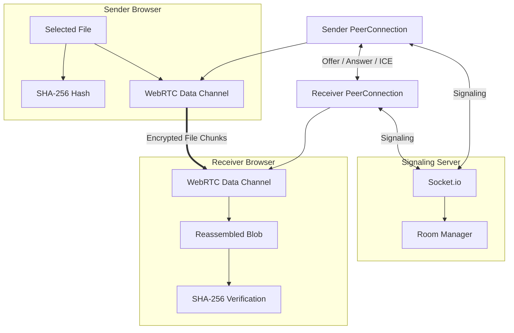

# QuickShare

A browser-based peer-to-peer file sharing application built using React, Node.js, Socket.io, and WebRTC.

The goal of this project was to create a secure file-sharing platform where files are transferred directly between devices without being uploaded to a central server. The signaling server is only responsible for establishing the connection between peers, while the actual file transfer happens through WebRTC Data Channels.

## Project Motivation

Traditional file-sharing applications usually require files to be uploaded to a server before they can be downloaded by another user. This introduces storage costs, privacy concerns, and additional transfer delays.

QuickShare was developed to explore peer-to-peer communication technologies and demonstrate how WebRTC can be used to create a secure and efficient file transfer system that operates entirely within modern web browsers.

## Key Features

* Direct browser-to-browser file transfer using WebRTC
* No file storage on the server
* Secure encrypted communication through WebRTC Data Channels
* SHA-256 based file integrity verification
* Real-time transfer progress tracking
* Transfer speed and completion estimates
* Configurable chunk-based file transmission
* Automatic file download after successful transfer
* Responsive user interface built with Tailwind CSS

## Technology Stack

### Frontend

* React
* Vite
* Tailwind CSS
* Socket.io Client

### Backend

* Node.js
* Express.js
* Socket.io

### Core Technologies

* WebRTC
* SHA-256 Hashing
* DTLS Encryption

## System Architecture



## How the Application Works

1. The sender selects a file.
2. A room is created and a unique room ID is generated.
3. The sender shares the generated link with the receiver.
4. The receiver joins the room.
5. Socket.io exchanges WebRTC signaling messages.
6. A direct peer-to-peer connection is established.
7. The file is divided into chunks and transmitted through the data channel.
8. The receiver reconstructs the file.
9. SHA-256 verification confirms file integrity.
10. The file is automatically downloaded.

## Project Structure

```text
quickshare/
├── client/
│   └── src/
│       ├── components/
│       ├── pages/
│       ├── hooks/
│       ├── context/
│       └── services/
│
├── server/
│   ├── socket/
│   ├── routes/
│   └── utils/
│
└── shared/
```

## Installation

### Prerequisites

* Node.js 18+
* npm

### Clone Repository

```bash
git clone <repository-url>
cd quickshare
```

### Install Dependencies

```bash
npm run install:all
```

### Configure Environment Variables

```bash
cp server/.env.example server/.env
cp client/.env.example client/.env
```

### Run Development Servers

Backend:

```bash
npm run dev:server
```

Frontend:

```bash
npm run dev:client
```

Open:

```text
http://localhost:5173
```

## Testing the Application

1. Open the application in Browser A.
2. Select a file and create a room.
3. Copy the generated room link.
4. Open the link in Browser B.
5. Wait for the peer connection to establish.
6. Observe transfer progress and integrity verification.

## Challenges Faced During Development

Some of the major challenges encountered while developing this project included:

* Understanding the WebRTC connection lifecycle.
* Managing offer, answer, and ICE candidate exchange.
* Handling interrupted peer connections.
* Designing a chunk-based transfer mechanism.
* Reassembling file chunks correctly at the receiver side.
* Implementing reliable SHA-256 integrity verification.
* Providing accurate progress and speed updates during transfer.

## Security Considerations

* Files are transferred directly between peers.
* WebRTC Data Channels use DTLS encryption.
* File contents are never stored on the signaling server.
* SHA-256 hashing ensures transferred files are not corrupted.
* Rooms automatically expire after inactivity.

## Current Limitations

* Large files may consume significant browser memory.
* Some networks may block WebRTC connections.
* TURN server support is not yet implemented.
* Only one receiver can join a room at a time.
* Refreshing the sender page requires restarting the transfer session.

## Future Improvements

Planned enhancements include:

* TURN server integration for improved connectivity.
* Multiple file transfer support.
* Pause and resume functionality.
* Transfer history management.
* Password-protected rooms.
* Drag-and-drop multi-file uploads.
* Improved mobile device support.

## Learning Outcomes

Through this project, I gained practical experience with:

* Peer-to-peer networking concepts
* WebRTC and Data Channels
* Real-time communication using Socket.io
* File chunking and binary data transfer
* Cryptographic hashing
* React state management
* Full-stack application deployment

## Deployment

### Frontend

Deploy the React application on Vercel.

### Backend

Deploy the signaling server on Render or Railway.

Ensure that:

* Frontend and backend URLs are correctly configured.
* CORS settings allow frontend communication.
* Environment variables are properly set.

## Author

Developed as a full-stack web development project to explore secure peer-to-peer file sharing using WebRTC and modern web technologies.

## License

This project is intended for educational and learning purposes.
